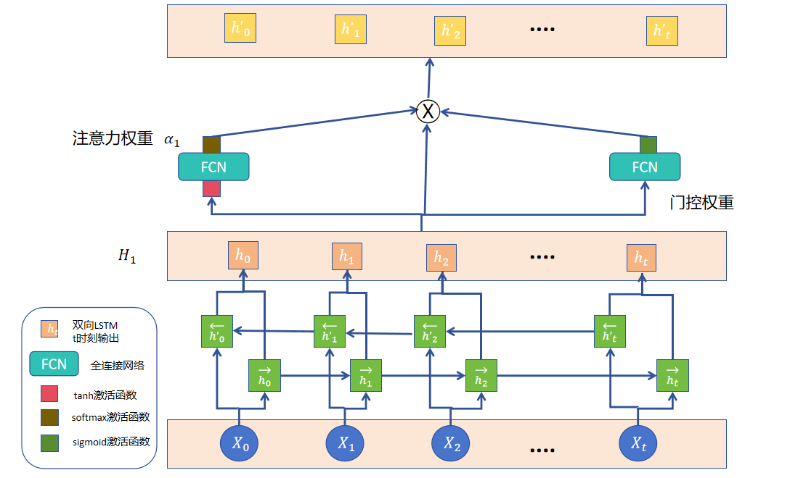
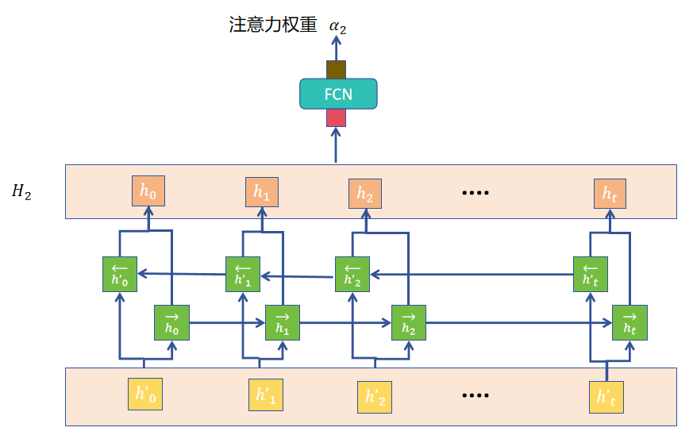
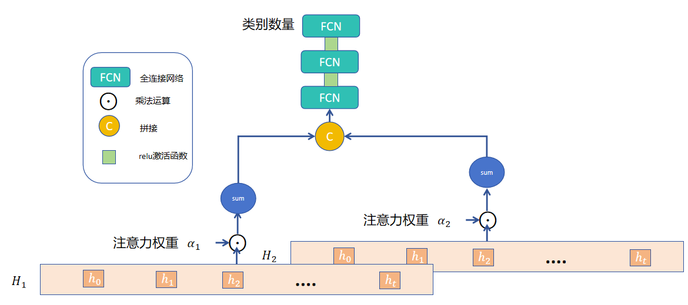

# 基于双层注意力重加权 LSTM 的中文长文本谣言检测模型
**摘要:**
虚假信息在社交媒体上传播迅速，会对公众的行为及对社会事件的反应产生负面影响。
长文本假新闻由于信息复杂，难以全面识别，现有的检测方法存在不足。针对上述现象，本
文提出一种基于双层注意力重加权的长文本谣言检测模型。模型采用双层双向 LSTM 架构，
通过第一层 LSTM 提取基础语义特征并结合 Tanh 非线性变换与线性层计算词级注意力权
重定位关键区域；第二层 LSTM 以 Sigmoid 门控网络生成的动态特征权重与第一层注意力
权重重加权后的特征为输入，进一步强化深层语义关联；最终拼接两层注意力的全局池化特
征，经多层全连接网络完成分类。在 LTCR 长文本中文谣言数据集（含 1,729 条真实新闻
与 561 条假新闻）上，模型表现优异：整体准确率达 96.29%，假新闻召回率高达 93.94%，
加权平均 F1 值为 0.9568，达到了业内领先水平。
## 网络结构
第一层LSTM结构: 
 
第二层LSTM结构: 
 
最终层-拼接输出层结构: 
 
## 运行环境
1. torch>=2.5.1
2. python>=3.10
3. numpy>=2.0.1
4. scikit-learn>=1.6.1
## 联系
[个人博客][py]

[py]: https://blog.csdn.net/2401_85464956?type=blog "个人博客"
